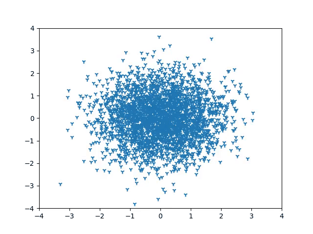
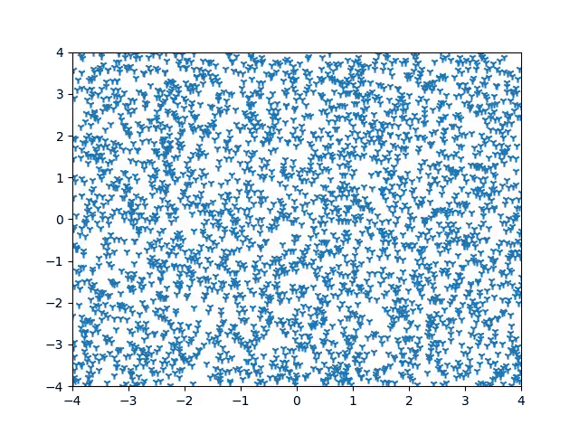

# INTRO.

This contains toy examples of diffusion and score based models.

The diffusion examples showcased the sample generation process from both swiss-roll shaped distribution and gaussian mixture distribution.

However, the score based example demonstrated only gmm case, because calcalating anaytical solution of the score function of swiss-roll distribuion is impossible.
I know we can approximate the score function if we use the complex and high-level skills[2]. But this is just simple toy examples, so I will left it back to later

I implemented the diffusion examples based on [1] and refered to [2] while implementing the score-based model example.

[1] https://github.com/albarji/toy-diffusion

[2] https://yang-song.net/blog/2021/score/

# Examples

Below is an example of a diffusion model generating samples from learned GMM distribuion.

&nbsp;

And below is an example of a score-based model generating samples from learned GMM distribution.

